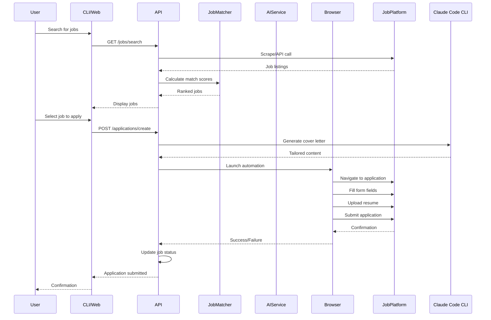
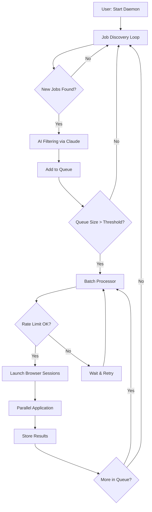

# Job Application Automation Tool - Feature Design & Architecture

## Context

The user wants to build an AI-powered job application automation tool that can **auto-apply to hundreds of jobs in bulk** with minimal user intervention. The tool will store personal information (resume, contact details, work history, skills) and automate the job application process across multiple platforms (LinkedIn, Indeed, and custom career pages). Key requirement: **mass application automation** that can run continuously, applying to jobs that match criteria, with full tracking of all applications. The tool should integrate with Claude Code CLI for AI capabilities (no separate API token needed) and support both CLI and web interfaces.

This is a greenfield project with no existing code. We need to design the complete architecture, features, and workflow optimized for **bulk automation**.

---

## Recommended Tech Stack

**Backend/Automation Engine:**
- **Python 3.11+** - Primary language for automation logic
  - Excellent AI/LLM integration (OpenAI, Anthropic, LangChain)
  - Rich ecosystem for web automation (Selenium, Playwright)
  - Strong data processing libraries (pandas, SQLAlchemy)

**Browser Automation:**
- **Playwright** (preferred over Selenium) - Modern, reliable, fast
  - Headless and headed modes
  - Better handling of dynamic content
  - Built-in waiting mechanisms
  - Screenshot and video recording for debugging

**AI/LLM Integration:**
- **Claude Code CLI Integration** - Leverage the current Claude Code session for AI capabilities
  - No separate API token required
  - Direct invocation from the job-apply CLI
  - Uses the user's existing Claude Code subscription
  - Can spawn Claude Code agents for specific tasks (cover letter generation, job analysis)

**Data Storage:**
- **SQLite** (initial) / **PostgreSQL** (production) - Structured data (applications, jobs, user profiles)
- **File system** - Resume PDFs, cover letters, supporting documents
- **Vector DB (ChromaDB/Pinecone)** - Optional: for semantic job matching

**Web Interface:**
- **FastAPI** - Modern Python web framework, async support, auto-generated API docs
- **React + TypeScript** - Frontend UI for dashboard
- **TailwindCSS** - Rapid UI development

**CLI:**
- **Typer** - Modern Python CLI framework with type hints and auto-completion

---

## Core Features (Phase 1 - MVP)

### 0. **Bulk Auto-Apply Engine** ⭐ **PRIMARY FEATURE**

This is the centerpiece of the tool - automated mass application with intelligent filtering and tracking.

**Key Capabilities:**

- **Interactive Learning System:** 🆕
  - When encountering uncertain/unknown form fields, pause and ask user
  - Save user's answers in knowledge base with context
  - Future applications learn from past answers
  - Build up response library over time
  - Example: "Desired salary?" → saves answer → reuses for similar questions
  - User can review pending questions queue: `job-apply questions pending`
  - Batch answer multiple questions at once
  - Export/import answer library for sharing

- **Continuous Job Discovery:**
  - Background process that continuously scrapes job boards
  - Discovers new jobs matching user criteria (keywords, location, salary, remote)
  - Deduplicates jobs across platforms
  - Adds to application queue automatically

- **Smart Filtering:**
  - Pre-screen jobs based on hard requirements (sponsorship, experience level, location)
  - AI-powered match scoring (via Claude Code CLI)
  - Auto-reject jobs below threshold (e.g., <60% match)
  - User-defined blacklist (companies, keywords to avoid)

- **Batch Application Workflow:**
  - Process application queue in batches (e.g., 20 jobs at a time)
  - Rate-limited to avoid platform bans (configurable: 10/hour LinkedIn, 20/hour Indeed)
  - Parallel processing with multiple browser sessions
  - Automatic retry on failures with exponential backoff

- **Intelligent Content Generation:**
  - Claude Code generates unique cover letters per job (not copy-paste)
  - Tailored answers for common questions
  - Resume selection based on job requirements
  - Caching similar responses for efficiency

- **Application Tracking:**
  - Store every application attempt (success/failure/skipped/pending-questions)
  - Track submission time, platform, job details
  - Store generated cover letters and answers
  - Status pipeline: Queued → Processing → **Pending Questions** → Submitted → Responded
  - Applications with unanswered questions pause in "Pending Questions" state

- **Monitoring & Alerts:**
  - Real-time dashboard showing applications/hour
  - Slack/email notifications on milestones (e.g., 100 applications submitted)
  - Error alerts when automation fails
  - Daily summary reports

**CLI Commands:**

```bash
# Start bulk auto-apply daemon (runs continuously)
job-apply daemon start --criteria "Software Engineer" --location "Remote" --max-per-day 50

# Check daemon status
job-apply daemon status

# View application queue
job-apply queue list

# Apply to next N jobs in queue
job-apply bulk-apply --count 20 --parallel 3

# Stop daemon
job-apply daemon stop
```

**Example Workflow (with Q&A System):**
1. User sets criteria: "Senior Python Engineer, Remote, >$120k"
2. Daemon discovers 300 matching jobs across LinkedIn + Indeed
3. AI filters to 180 high-match jobs (>70% score)
4. Daemon starts auto-applying:
   - **First 10 applications:** Bot encounters 15 unknown questions (salary, relocation, etc.)
   - Applications pause in `PENDING_QUESTIONS` state
   - User gets notification: "15 questions need answers"
5. User answers questions via CLI:
   ```bash
   job-apply questions list
   # Shows 15 pending questions
   
   job-apply questions batch-answer
   # Interactive prompt to answer all at once
   ```
6. Answers saved to knowledge base
7. Bot resumes paused applications and continues with remaining jobs
8. **Next 170 applications:** Bot reuses saved answers (90% match rate)
9. Only 5 new questions pop up (edge cases)
10. After 18 hours: 180 applications submitted
11. Knowledge base now has 20 reusable answer templates
12. **Next batch of 200 jobs:** Bot answers 98% automatically using learned responses

---

## Core Features (Continued)

### 1. **User Profile Management**
- **Personal Information Storage:**
  - Contact details (name, email, phone, location, LinkedIn URL)
  - Work authorization status (citizen, visa type, sponsorship needs)
  - Availability (start date, notice period)
  - Salary expectations (ranges by role/location)

- **Resume Management:**
  - Upload multiple resume versions (by role, industry, format)
  - Parse resume content (extract skills, experience, education)
  - Tag resumes (e.g., "Software Engineer", "Senior Role", "Startup Focused")
  - Default resume selection rules

- **Work History:**
  - Structured employment history with dates, titles, companies, descriptions
  - Project highlights and achievements
  - Technologies used per role
  - Reusable bullet points library

- **Skills Database:**
  - Technical skills with proficiency levels
  - Soft skills
  - Certifications and licenses
  - Languages spoken

- **Education:**
  - Degrees, institutions, graduation dates, GPAs
  - Relevant coursework

- **Supporting Documents:**
  - Cover letter templates
  - References and recommendation letters
  - Portfolio links
  - GitHub/personal website URLs

### 2. **Job Discovery & Tracking**

- **Job Board Integration:**
  - **LinkedIn Jobs:** Search by keywords, location, filters
  - **Indeed:** API or scraping with rate limiting
  - **Generic scrapers:** Configurable for common career page patterns

- **Job Matching Intelligence:**
  - Parse job descriptions
  - Calculate match score (skills overlap, experience level, location)
  - Flag keywords that indicate good/poor fit
  - Prioritize jobs based on user preferences

- **Job Pipeline Management:**
  - Statuses: Discovered → Reviewed → Applied → Interview → Offer → Rejected/Accepted
  - Metadata: company, role, salary range, posting date, application deadline
  - Notes field for each job

### 3. **Intelligent Application Automation**

- **Form Field Detection & Mapping:**
  - Detect common form fields (name, email, phone, work history, education)
  - Map user profile data to detected fields
  - Handle dropdown selections intelligently
  - File upload detection (resume, cover letter)

- **LinkedIn Easy Apply:**
  - Automate "Easy Apply" button clicks
  - Navigate multi-step forms
  - Handle security questions and assessments
  - Follow-up message generation

- **Indeed Quick Apply:**
  - Similar automation for Indeed's application flow
  - Resume upload and form pre-fill

- **Generic Form Handling:**
  - Configurable selectors for common form patterns
  - Heuristic-based field detection
  - Fallback to manual review for complex forms

- **AI-Powered Content Generation (via Claude Code CLI):**
  - **Cover Letter Generation:** 
    - Invoke Claude Code with job description + user profile context
    - Generate tailored cover letter leveraging current session
    - Incorporate company research from web search
    - Match tone to company culture
    - Command: `job-apply generate cover-letter JOB_ID` (internally calls Claude Code)
  
  - **Resume Tailoring:**
    - Reorder/highlight relevant skills
    - Adjust bullet points to match job keywords (without lying)
    - Suggest which resume version to use
    - Command: `job-apply analyze resume JOB_ID` (Claude Code suggests optimizations)
  
  - **Answer Generator for Text Fields:**
    - "Why do you want to work here?"
    - "Tell us about yourself"
    - "Why are you a good fit?"
    - Generate responses by piping context to Claude Code CLI
    - Command: `job-apply generate answer "question text" JOB_ID`

### 4. **Application Tracking & Analytics**

- **Submission History:**
  - Record every application with timestamp
  - Store submitted resume and cover letter versions
  - Track application method (automated vs manual)

- **Response Tracking:**
  - Email integration to detect responses (Gmail API)
  - Parse rejection/interview invitation emails
  - Update job status automatically

- **Analytics Dashboard:**
  - Application success rate by platform, role, company size
  - Average time to response
  - Most effective resume versions
  - Skills gap analysis (jobs you're missing vs jobs you get)

### 5. **Interactive Q&A Learning System** 🆕

When the automation encounters questions it can't confidently answer, it saves them for user review instead of guessing or skipping.

**How It Works:**

1. **Question Detection:**
   - Bot encounters unfamiliar form field (e.g., "Are you willing to relocate?")
   - AI checks knowledge base for similar past questions
   - If no match found → pause application, create pending question

2. **Question Queue:**
   - All pending questions stored in `pending_questions` table
   - Linked to specific job application
   - Includes: question text, field type, context (company, role, platform)
   - User reviews queue via CLI or web UI

3. **User Answers Questions:**
   ```bash
   # View pending questions
   job-apply questions list
   # Output:
   # ID  Job                          Question
   # 1   Google - SWE                 Are you willing to relocate? (Yes/No)
   # 2   Amazon - Senior Dev          Desired salary range? (Text)
   # 3   Meta - Frontend Engineer     Years of React experience? (Number)
   
   # Answer specific question
   job-apply questions answer 1 --response "Yes"
   
   # Batch answer multiple
   job-apply questions batch-answer
   # Opens interactive prompt for all pending questions
   
   # Mark question as "ask every time" (never auto-fill)
   job-apply questions set-policy 2 --always-ask
   ```

4. **Knowledge Base Building:**
   - Each answer stored with:
     - Question text and normalized form
     - User's response
     - Context: company type, role, industry
     - Reusability: "always same", "context-dependent", "always ask"
   - AI extracts patterns from similar questions
   - Example: "Desired salary?" and "Salary expectations?" → same intent

5. **Intelligent Reuse:**
   - Future applications check knowledge base first
   - Fuzzy matching for similar questions
   - Context-aware answers (e.g., salary differs by role/location)
   - Confidence scoring: high confidence → auto-fill, low → ask user
   
   ```python
   # Example knowledge base entries
   {
       "question": "Are you willing to relocate?",
       "patterns": ["willing to relocate", "open to relocation", "can you move"],
       "answer": "Yes",
       "reuse_policy": "always_same",
       "confidence": 0.95
   },
   {
       "question": "Desired salary range?",
       "patterns": ["salary expectations", "desired compensation", "salary range"],
       "answer_template": "$120k-$150k for Senior roles, $90k-$110k for Mid-level",
       "reuse_policy": "context_dependent",
       "context_factors": ["role_level", "location"],
       "confidence": 0.85
   }
   ```

6. **Resume Application:**
   - After answering questions, user triggers resume
   - Bot continues from where it paused
   - Fills in answered questions and completes submission

   ```bash
   # Resume paused applications after answering questions
   job-apply resume-paused --all
   # Or resume specific application
   job-apply resume-paused 12345
   ```

**Benefits:**
- **Never submit wrong answers** - bot asks instead of guessing
- **Learn over time** - first 50 applications may have many questions, next 50 have fewer
- **Transparency** - user always knows what was submitted
- **Flexibility** - can mark sensitive questions to always ask (salary negotiations, start dates)

---

### 6. **Safety & Compliance Features**

- **Rate Limiting:**
  - Throttle applications per platform (e.g., max 10/day on LinkedIn)
  - Random delays between actions to avoid detection
  - Respect robots.txt

- **Manual Review Queue:**
  - Flag applications for manual review before submission
  - Preview auto-generated content
  - Confirmation prompts for critical actions

- **Session Management:**
  - Handle login sessions across platforms
  - Secure credential storage (encrypted)
  - 2FA support (manual step)

- **Error Handling & Recovery:**
  - Screenshot on errors for debugging
  - Retry logic with exponential backoff
  - Graceful degradation (fall back to manual)

---

## Advanced Features (Phase 2 - Future Enhancements)

### 6. **Interview Preparation Assistant**
- Extract common interview questions from job description
- Generate STAR-method answers from work history
- Schedule tracking and reminders
- Post-interview note-taking

### 7. **Company Research Automation**
- Scrape company info (size, funding, culture, reviews)
- Glassdoor integration for salary data and reviews
- Recent news and press releases
- Employee connections on LinkedIn

### 8. **Networking Automation**
- Auto-connect with recruiters and employees
- Message templates for cold outreach
- Track conversation history

### 9. **Offer Management**
- Compare multiple offers side-by-side
- Negotiation strategy suggestions
- Deadline tracking

### 10. **Chrome Extension**
- One-click apply from any job listing page
- Pre-fill forms in real-time while browsing
- Save jobs for later review

---

## System Architecture

```
┌─────────────────────────────────────────────────────────────┐
│                        User Interfaces                       │
│  ┌──────────────────┐         ┌──────────────────────┐     │
│  │   CLI (Typer)    │         │  Web UI (React)      │     │
│  │  - Apply jobs    │         │  - Dashboard         │     │
│  │  - Manage profile│         │  - Profile editor    │     │
│  │  - View status   │         │  - Job browser       │     │
│  └──────────────────┘         └──────────────────────┘     │
└─────────────────────┬───────────────────┬───────────────────┘
                      │                   │
                      ▼                   ▼
┌─────────────────────────────────────────────────────────────┐
│                    API Layer (FastAPI)                       │
│  - REST endpoints for CRUD operations                        │
│  - WebSocket for real-time automation status                │
│  - Authentication & authorization                            │
└─────────────────────┬───────────────────────────────────────┘
                      │
                      ▼
┌─────────────────────────────────────────────────────────────┐
│                    Business Logic Layer                      │
│  ┌────────────────┐  ┌──────────────┐  ┌────────────────┐  │
│  │  Profile Mgmt  │  │ Job Matching │  │  Application   │  │
│  │   - Parser     │  │  - Scoring   │  │   - Workflow   │  │
│  │   - Validator  │  │  - Filtering │  │   - Tracking   │  │
│  └────────────────┘  └──────────────┘  └────────────────┘  │
└─────────────────────┬───────────────────────────────────────┘
                      │
                      ▼
┌─────────────────────────────────────────────────────────────┐
│                  Automation Engine Layer                     │
│  ┌────────────────┐  ┌──────────────┐  ┌────────────────┐  │
│  │   Playwright   │  │Claude Code   │  │  Job Scrapers  │  │
│  │   - Browser    │  │Integration   │  │  - LinkedIn    │  │
│  │   - Sessions   │  │  - CLI Spawn │  │  - Indeed      │  │
│  │   - Actions    │  │  - Prompts   │  │  - Generic     │  │
│  └────────────────┘  └──────────────┘  └────────────────┘  │
└─────────────────────┬───────────────────────────────────────┘
                      │
                      ▼
┌─────────────────────────────────────────────────────────────┐
│                      Data Layer                              │
│  ┌────────────────┐  ┌──────────────┐  ┌────────────────┐  │
│  │   Database     │  │  File Store  │  │  Vector DB     │  │
│  │ - SQLAlchemy   │  │  - Resumes   │  │ - Job Vectors  │  │
│  │ - PostgreSQL   │  │  - Docs      │  │ - ChromaDB     │  │
│  └────────────────┘  └──────────────┘  └────────────────┘  │
└─────────────────────────────────────────────────────────────┘
```

---

## Workflow: End-to-End Job Application

### **User Flow:**

1. **Setup (One-time):**
   ```bash
   # CLI Commands
   job-apply init                          # Create config directory
   job-apply profile create               # Interactive profile setup
   job-apply profile add-resume resume.pdf # Upload resume
   job-apply auth linkedin                # Login to LinkedIn (saves session)
   job-apply auth indeed                  # Login to Indeed
   ```

2. **Job Discovery:**
   ```bash
   # Search jobs
   job-apply search "Senior Software Engineer" --location "San Francisco" --remote
   
   # Or use web UI to browse jobs with filters
   ```

3. **Review & Select Jobs:**
   ```bash
   # List discovered jobs
   job-apply jobs list --status discovered
   
   # View job details
   job-apply jobs view JOB_ID
   
   # Mark jobs for application
   job-apply jobs mark JOB_ID --apply
   ```

4. **Bulk Automated Application:**
   ```bash
   # Start continuous auto-apply daemon
   job-apply daemon start --criteria "Senior Engineer" --remote --max-daily 50
   
   # Or manually trigger bulk apply for queued jobs
   job-apply bulk-apply --count 100 --parallel 5
   
   # Preview what will be applied
   job-apply queue preview --next 20
   ```

5. **Monitor Progress:**
   ```bash
   # Check application status
   job-apply status
   
   # View analytics
   job-apply analytics --last-30-days
   ```

### **System Flow (Behind the Scenes):**



---

## Project Structure

```
JobApplyTool/
├── backend/
│   ├── app/
│   │   ├── __init__.py
│   │   ├── main.py                    # FastAPI app entry
│   │   ├── api/
│   │   │   ├── __init__.py
│   │   │   ├── auth.py               # Authentication endpoints
│   │   │   ├── profile.py            # Profile management
│   │   │   ├── jobs.py               # Job discovery & tracking
│   │   │   └── applications.py       # Application workflow
│   │   ├── automation/
│   │   │   ├── __init__.py
│   │   │   ├── browser.py            # Playwright wrapper
│   │   │   ├── daemon.py             # Continuous auto-apply daemon
│   │   │   ├── queue_manager.py      # Application queue management
│   │   │   ├── batch_processor.py    # Bulk application processor
│   │   │   ├── platforms/
│   │   │   │   ├── linkedin.py       # LinkedIn automation
│   │   │   │   ├── indeed.py         # Indeed automation
│   │   │   │   └── generic.py        # Generic form handler
│   │   │   └── scrapers/
│   │   │       ├── linkedin_scraper.py
│   │   │       └── indeed_scraper.py
│   │   ├── ai/
│   │   │   ├── __init__.py
│   │   │   ├── claude_code_client.py # Claude Code CLI integration
│   │   │   ├── prompts.py            # Prompt templates
│   │   │   └── generators.py         # Cover letter, answers via CLI
│   │   ├── models/
│   │   │   ├── __init__.py
│   │   │   ├── user.py               # User profile models
│   │   │   ├── job.py                # Job models
│   │   │   └── application.py        # Application models
│   │   ├── services/
│   │   │   ├── __init__.py
│   │   │   ├── profile_service.py
│   │   │   ├── job_matcher.py
│   │   │   ├── application_service.py
│   │   │   ├── question_service.py     # Q&A management
│   │   │   └── knowledge_base.py       # Answer reuse logic
│   │   ├── database/
│   │   │   ├── __init__.py
│   │   │   ├── session.py            # SQLAlchemy session
│   │   │   └── migrations/           # Alembic migrations
│   │   └── config.py                 # Configuration settings
│   ├── tests/
│   │   ├── test_automation.py
│   │   ├── test_ai.py
│   │   └── test_api.py
│   └── requirements.txt
├── frontend/
│   ├── src/
│   │   ├── components/
│   │   │   ├── Dashboard.tsx
│   │   │   ├── ProfileEditor.tsx
│   │   │   ├── JobBrowser.tsx
│   │   │   └── ApplicationTracker.tsx
│   │   ├── api/
│   │   │   └── client.ts             # API client
│   │   ├── App.tsx
│   │   └── main.tsx
│   ├── package.json
│   └── tsconfig.json
├── cli/
│   ├── __init__.py
│   ├── main.py                       # Typer CLI entry
│   ├── commands/
│   │   ├── __init__.py
│   │   ├── profile.py
│   │   ├── jobs.py
│   │   ├── apply.py
│   │   ├── daemon.py                # Daemon control (start/stop/status)
│   │   ├── queue.py                 # Queue management
│   │   ├── bulk.py                  # Bulk operations
│   │   └── auth.py
│   └── utils.py
├── data/
│   ├── resumes/                      # User uploaded resumes
│   ├── cover_letters/                # Generated cover letters
│   └── screenshots/                  # Debug screenshots
├── docs/
│   ├── ARCHITECTURE.md
│   ├── API.md
│   └── USER_GUIDE.md
├── .env.example                      # Environment variables template
├── docker-compose.yml                # Local development setup
├── pyproject.toml                    # Python project config
├── README.md
└── LICENSE
```

---

## Implementation Phases

### **Phase 1: Foundation (Weeks 1-2)**
- Set up project structure and dependencies
- Database schema and models (with queue tables)
- Basic CLI for profile management
- Resume upload and parsing
- Job scrapers (LinkedIn + Indeed)

### **Phase 2: Core Automation (Weeks 3-4)**
- Playwright browser automation setup
- LinkedIn Easy Apply automation
- Indeed Quick Apply automation
- Basic batch processor (apply to 10 jobs)
- Error handling and retry logic

### **Phase 3: Bulk Auto-Apply Engine (Weeks 5-6)** ⭐ **CRITICAL**
- Daemon process (continuous background job discovery)
- Application queue manager
- Rate limiting and throttling
- Parallel browser session management
- Batch processor optimization (100+ jobs)
- Progress tracking and logging

### **Phase 4: Interactive Q&A System (Weeks 7-8)** 🆕
- Pending questions queue implementation
- Knowledge base for storing user answers
- Fuzzy matching for similar questions
- CLI commands for answering questions
- Resume paused applications feature
- Context-aware answer reuse logic

### **Phase 5: AI Integration via Claude Code CLI (Weeks 9-10)**
- Claude Code CLI subprocess integration
- Bulk cover letter generation (caching for similar jobs)
- AI-powered job filtering and match scoring
- Form field answer generation at scale
- AI assistance for suggesting answers to pending questions

### **Phase 6: Web Interface (Weeks 11-12)**
- FastAPI backend with REST endpoints
- React frontend dashboard (real-time stats)
- Application queue viewer
- **Pending questions interface** (answer questions via web UI)
- Daemon control panel
- Analytics and charts

### **Phase 7: Polish & Enhancement (Weeks 13-14)**
- Advanced analytics and reporting
- Email integration for response tracking
- Notification system (Slack, email alerts)
- Knowledge base export/import
- Performance optimization
- Documentation and testing

---

## Key Technical Considerations

### **Security:**
- Encrypt stored credentials (Fernet or similar)
- No API keys needed (uses Claude Code CLI session)
- Implement rate limiting to avoid bans
- User consent for automated actions
- GDPR compliance for personal data

### **Reliability:**
- Robust error handling and retries
- Logging and monitoring
- Screenshot on errors for debugging
- Graceful fallback to manual mode
- Session persistence across runs

### **Scalability:**
- Background job queue (Celery/Redis) for async automation
- Support multiple user profiles
- Concurrent application processing (with rate limits)
- Database indexing for fast queries

### **Maintainability:**
- Platform selectors in config files (easy to update when sites change)
- Modular architecture (easy to add new platforms)
- Comprehensive logging
- Unit and integration tests

---

## Risk Mitigation

**Platform Detection/Bans:**
- Use residential proxies if needed
- Rotate user agents
- Human-like delays and mouse movements
- Limit applications per day

**Frequent UI Changes:**
- Use flexible selectors (data attributes > IDs > classes)
- Implement fallback strategies
- Monitor for selector failures
- Version platform handlers

**Ethical Concerns:**
- Transparency about automation
- User review before submission
- Don't spam applications
- Respect platform terms of service

---

## Success Metrics

- **Application Volume:** Target **200-500 applications/week** with bulk automation
- **Time Savings:** Reduce time per application from 30min to **<2min automated** (zero user intervention)
- **Throughput:** Process **50+ applications/day** continuously
- **Success Rate:** >90% successful submissions (accounting for platform changes)
- **Response Rate:** Track and optimize for higher interview rates
- **Error Recovery:** Auto-retry failed applications, <5% permanent failures
- **User Satisfaction:** Set-and-forget automation, clear tracking dashboard

---

## Bulk Auto-Apply Architecture

### **Daemon Process Flow:**



### **Application Queue States:**

```
DISCOVERED → FILTERED → QUEUED → PROCESSING → PENDING_QUESTIONS → SUBMITTED → RESPONDED
                ↓                      ↓              ↓               ↓
             REJECTED              FAILED    (paused until answered)  REJECTED_BY_PLATFORM
                                                      ↓
                                              USER_ANSWERS_QUESTIONS
                                                      ↓
                                               RESUME_PROCESSING → SUBMITTED
```

**State Transitions:**
- `PROCESSING → PENDING_QUESTIONS`: Bot encounters unknown form field
- `PENDING_QUESTIONS → PROCESSING`: User answers questions, bot resumes
- `PENDING_QUESTIONS → FAILED`: User skips or timeout expires

### **Rate Limiting Strategy:**

```python
# Example rate limit config
RATE_LIMITS = {
    'linkedin': {
        'max_per_hour': 10,
        'max_per_day': 50,
        'delay_between': (120, 300),  # 2-5 minutes random
    },
    'indeed': {
        'max_per_hour': 20,
        'max_per_day': 100,
        'delay_between': (60, 180),   # 1-3 minutes random
    }
}
```

### **Parallel Processing:**

- Run 3-5 browser sessions concurrently
- Each session handles one platform
- Sessions coordinate via shared queue
- Distributed locks prevent duplicate applications

### **Storage Schema for Bulk Tracking:**

```sql
-- applications table
CREATE TABLE applications (
    id INTEGER PRIMARY KEY,
    job_id INTEGER,
    status VARCHAR(20),  -- queued, processing, submitted, failed
    platform VARCHAR(20), -- linkedin, indeed, etc.
    submitted_at TIMESTAMP,
    cover_letter_path TEXT,
    resume_path TEXT,
    error_message TEXT,
    retry_count INTEGER DEFAULT 0
);

-- application_queue table
CREATE TABLE application_queue (
    id INTEGER PRIMARY KEY,
    job_id INTEGER,
    priority INTEGER,  -- higher = process first
    match_score FLOAT,
    added_at TIMESTAMP,
    status VARCHAR(20) DEFAULT 'queued'
);

-- daily_stats table
CREATE TABLE daily_stats (
    date DATE PRIMARY KEY,
    applications_submitted INTEGER,
    applications_failed INTEGER,
    platforms_used TEXT,  -- JSON: {"linkedin": 20, "indeed": 15}
    avg_success_rate FLOAT
);

-- pending_questions table (NEW)
CREATE TABLE pending_questions (
    id INTEGER PRIMARY KEY,
    application_id INTEGER,  -- FK to applications
    job_id INTEGER,
    question_text TEXT,
    field_type VARCHAR(20),  -- text, dropdown, number, yes_no
    context TEXT,            -- JSON: company, role, platform info
    status VARCHAR(20) DEFAULT 'pending',  -- pending, answered, skipped
    created_at TIMESTAMP,
    answered_at TIMESTAMP,
    user_answer TEXT
);

-- knowledge_base table (NEW)
CREATE TABLE knowledge_base (
    id INTEGER PRIMARY KEY,
    question_normalized TEXT,  -- normalized form for matching
    question_patterns TEXT,    -- JSON array of similar phrasings
    answer TEXT,
    answer_template TEXT,      -- for context-dependent answers
    reuse_policy VARCHAR(20),  -- always_same, context_dependent, always_ask
    context_factors TEXT,      -- JSON: what factors affect the answer
    confidence FLOAT,          -- 0-1, how confident we are in reuse
    usage_count INTEGER DEFAULT 0,
    last_used TIMESTAMP,
    created_at TIMESTAMP
);
```

---

## Claude Code CLI Integration Details

### **How It Works:**

The tool integrates with Claude Code CLI as a subprocess, passing structured prompts and receiving AI-generated content without requiring a separate API token.

**Example Integration:**

```python
# backend/app/ai/claude_code_client.py
import subprocess
import json

class ClaudeCodeClient:
    def generate_cover_letter(self, job_description: str, user_profile: dict) -> str:
        """Generate cover letter by invoking Claude Code CLI."""
        
        prompt = f"""
        Generate a professional cover letter for the following job:
        
        Job Description:
        {job_description}
        
        Candidate Profile:
        - Name: {user_profile['name']}
        - Experience: {user_profile['work_history']}
        - Skills: {user_profile['skills']}
        
        Requirements:
        - Tailor to the job description
        - Highlight relevant experience
        - Professional tone
        - Keep under 400 words
        """
        
        # Invoke Claude Code CLI
        result = subprocess.run(
            ['claude', '--prompt', prompt, '--output', 'text'],
            capture_output=True,
            text=True
        )
        
        return result.stdout.strip()
    
    def analyze_job_match(self, job_description: str, user_profile: dict) -> dict:
        """Calculate job match score using Claude's analysis."""
        
        prompt = f"""
        Analyze how well this candidate matches the job requirements.
        
        Job: {job_description}
        Candidate Skills: {user_profile['skills']}
        
        Provide JSON output with:
        - match_score (0-100)
        - matching_skills (list)
        - missing_skills (list)
        - recommendation (apply/skip/maybe)
        """
        
        result = subprocess.run(
            ['claude', '--prompt', prompt, '--output', 'json'],
            capture_output=True,
            text=True
        )
        
        return json.loads(result.stdout)
```

**CLI Commands with AI:**

```bash
# Generate cover letter for a job
job-apply generate cover-letter 12345
# Internally: spawns Claude Code, generates letter, saves to DB

# Analyze if a job is a good fit
job-apply analyze job 12345
# Internally: Claude Code scores match based on profile

# Get answer suggestions for application questions
job-apply suggest-answer "Why do you want to work here?" 12345
# Internally: Claude Code generates contextual answer
```

**Benefits:**
- No separate API token management
- Leverages user's existing Claude Code subscription
- Seamless integration within the same environment
- Can use all Claude Code features (agents, tools, etc.)

---

## Next Steps (Implementation Order)

### **Week 1: Setup & Foundation**
1. Create `docs/` directory and copy this plan as `docs/DESIGN.md`
2. Set up Python project structure (Poetry)
3. Initialize SQLite database with queue tables
4. Build basic CLI for profile management
5. Test Claude Code CLI integration (subprocess calls)
6. Create job data models (Job, Application, Queue)

### **Week 2: Job Discovery**
6. Implement LinkedIn job scraper
7. Implement Indeed job scraper
8. Build job deduplication logic
9. Create application queue manager
10. Test continuous job discovery loop

### **Week 3-4: Browser Automation**
11. Set up Playwright with session management
12. Implement LinkedIn Easy Apply automation
13. Implement Indeed Quick Apply automation
14. Add error handling and retry logic
15. Test batch processing (10 jobs)

### **Week 5-6: Bulk Automation Engine** ⭐
16. Build daemon process (start/stop/status)
17. Implement rate limiting per platform
18. Add parallel browser session support
19. Optimize batch processor for 100+ jobs
20. Add progress tracking and logging
21. **Test bulk apply: 100 jobs end-to-end**

### **Week 7-8: AI Integration**
22. Integrate Claude Code CLI for cover letters
23. Implement AI job filtering and scoring
24. Add answer generation for common questions
25. Cache similar responses for efficiency
26. **Test AI-generated content quality**

### **Week 9-10: Web Dashboard**
27. Build FastAPI backend
28. Create React frontend with real-time stats
29. Add daemon control panel
30. Implement application queue viewer
31. Add analytics charts

### **Week 11-12: Polish**
32. Add notification system (email, Slack)
33. Implement email response tracking
34. Performance optimization
35. Write documentation
36. **Deploy and iterate based on real usage**

---

## Getting Started Command Sequence

```bash
# Initial setup
cd JobApplyTool
poetry init
poetry add typer playwright fastapi sqlalchemy
poetry add --dev pytest

# Initialize project
poetry run job-apply init

# Set up profile
poetry run job-apply profile create
poetry run job-apply profile add-resume ~/resume.pdf

# Authenticate platforms
poetry run job-apply auth linkedin
poetry run job-apply auth indeed

# Start daemon for bulk auto-apply
poetry run job-apply daemon start \
  --criteria "Senior Software Engineer" \
  --location "Remote" \
  --max-daily 50 \
  --platforms linkedin,indeed

# Monitor progress
poetry run job-apply daemon status
poetry run job-apply stats --today

# View applications
poetry run job-apply applications list --status submitted

# Q&A Workflow Commands
poetry run job-apply questions list
poetry run job-apply questions answer 123 --response "Yes"
poetry run job-apply questions batch-answer
poetry run job-apply resume-paused --all

# View knowledge base
poetry run job-apply knowledge list
poetry run job-apply knowledge export answers.json
poetry run job-apply knowledge import answers.json
```

---

## Example Session: First-Time User Experience

```bash
# Day 1: Initial setup
$ job-apply daemon start --criteria "Senior Engineer" --remote --max-daily 20

Daemon started. Discovering jobs...
Found 50 jobs matching criteria.
Filtering with AI... 35 jobs queued for application.

Starting applications...
Applied to: Google - Senior SWE (submitted)
Applied to: Amazon - Principal Engineer (PENDING QUESTIONS - 3 questions)
Applied to: Meta - Staff Engineer (PENDING QUESTIONS - 2 questions)
Applied to: Netflix - Senior Backend (PENDING QUESTIONS - 1 question)

⚠️  4 applications paused. 6 questions need answers.
Run: job-apply questions list

# Check pending questions
$ job-apply questions list

ID   Job                    Question                               Type
1    Amazon - Principal     Are you willing to relocate?           yes_no
2    Amazon - Principal     Desired salary range?                  text
3    Amazon - Principal     Years of AWS experience?               number
4    Meta - Staff Engineer  Expected start date?                   text
5    Meta - Staff Engineer  Visa sponsorship required?             yes_no
6    Netflix - Senior       Why do you want to work at Netflix?    text

# Answer questions interactively
$ job-apply questions batch-answer

Question 1/6: Are you willing to relocate? [yes/no]
> no

Question 2/6: Desired salary range?
> $150k-$180k

Question 3/6: Years of AWS experience?
> 5

Question 4/6: Expected start date?
> 2 weeks notice

Question 5/6: Visa sponsorship required? [yes/no]
> no

Question 6/6: Why do you want to work at Netflix?
> [Claude suggests answer based on profile + job description]
> Suggested: "I'm passionate about building scalable streaming systems..."
> Accept? [y/n] y

✅ Answers saved to knowledge base.
Resuming paused applications...

Applied to: Amazon - Principal Engineer (submitted)
Applied to: Meta - Staff Engineer (submitted)
Applied to: Netflix - Senior Backend (submitted)

Continuing daemon... 31 jobs remaining in queue.

# Next 20 applications
$ job-apply daemon status

Applications today: 24/20 (4 over limit, paused)
Pending questions: 2 (new edge cases)
Knowledge base: 6 reusable answers

# Day 2: Much smoother
$ job-apply daemon start --criteria "Senior Engineer" --remote --max-daily 30

Found 60 jobs. Filtering... 45 queued.
Auto-applying with learned responses...

Applications: 30/30 (completed)
Pending questions: 1 (new company-specific question)
Reused answers: 94% success rate
```
